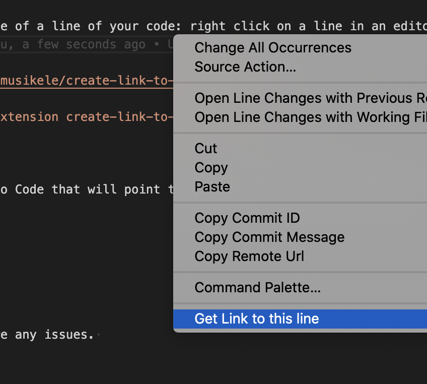

# create-link-to-git-server README

Easily share a link to VSC website of a line of your code: right click on a line in an editor, an click the item "Get link to this line". 

Github repo: `https://github.com/musikele/create-link-to-git-server` 

Manual install: `code --install-extension create-link-to-git-server-0.0.1.vsix`

## Features

Generate a link from Visual Studio Code that will point to popular git servers, like github or gitlab. 

## Extension Settings

No settings needed.

## Known Issues

Let me know on github if there are any issues. 

## Release Notes

### 0.0.2

first working version